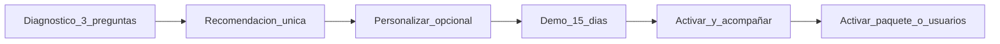

# Estrategia Comercial Propia — Alahia ERP
**MacroBits · Julio 2026 · Arquitectura comercial (sin precios fijos)**

> Filosofía: el cliente paga por el valor que recibe; el sistema crece con el negocio; no castigamos por vender más; competimos por valor, simplicidad y servicio; precios competitivos y sostenibles; mejor relación valor/precio, no el más barato.

Este documento convierte la investigación competitiva en **decisiones concretas** para construir un modelo propio, sin copiar a Alegra, Unolet, Sicflex u otros.

---

## 1. Diagnóstico comercial (lo que no haremos)

| Error del mercado | Por qué lo evitamos |
|-------------------|---------------------|
| 5+ productos hermanos (Facturación / POS / ERP / Nómina) | Confunde la compra y obliga a “recomprar” para crecer |
| Castigar por facturas o ingresos | El cliente siente que lo penalizan por vender |
| e-CF escondido como add-on sorpresa | Rompe la promesa de cumplimiento DGII |
| Reportes básicos bloqueados en plan alto | Genera las peores reseñas |
| Precio “desde $0” con TCO opaco | Destruye confianza |
| Compra por cotización eterna | Pierde pyme digital |

**Promesa Alahia:** un solo ERP; compra simple; creces activando valor, no cambiando de producto.

---

## 2. Mapa de valor (qué es básico, intermedio, avanzado)

Clasificación basada en capacidades reales del producto (menú/módulos actuales) y en lo que el mercado RD ya considera “debería venir incluido”.

### 2.1 Núcleo inseparable (nunca cobrado por separado)

Si el cliente paga Alahia, esto **siempre** está disponible en la experiencia contratada (según el nivel, con profundidad distinta, pero sin “comprar otra app”).

| Área | Capacidades |
|------|-------------|
| Plataforma | Empresa, parámetros, empleados, usuarios, perfiles, tickets de soporte |
| Comercial básico | Clientes, categorías, productos, POS / órdenes, histórico, devoluciones, notas de crédito, descuentos |
| Cobro operativo | Caja (apertura/movimientos/cierre), listado de pagos, cobros vinculados |
| Fiscal base | Secuencias NCF / preparación e-CF, reportes 606/607 esenciales |
| Visibilidad | Dashboard básico, reporte de ventas, reportes de clientes/productos mínimos |
| Relación | CxC básica (facturas por cobrar) |

**Regla:** no vender “reportes de venta”, “usuarios admin” o “606/607” como premium si ya se prometió operar y cumplir.

### 2.2 Intermedio — Control operativo

| Área | Capacidades |
|------|-------------|
| Inventario | Almacenes, movimientos, conduces, pérdidas |
| Compras | Proveedores, órdenes de compra, facturas de compra, CxP, análisis producto-proveedor |
| Finanzas | Cuentas financieras, movimientos, transferencias, métodos de pago→cuenta, gastos, ingresos |
| Crédito | Antigüedad CxC / CxP |
| Multi-ubicación | Más de un almacén / operación multi-caja avanzada |

### 2.3 Avanzado — ERP de control

| Área | Capacidades |
|------|-------------|
| Contabilidad | Catálogo, asientos, diario, mayor, balances, resultados, cierre, integración |
| Patrimonio | Activos fijos |
| Gerencia | Dashboard gerencial profundo, reportes de empleados/comisiones/servicios ampliados |
| Automatización | Integraciones contables automáticas, políticas de operación maduras |

### 2.4 Complementos legítimos (sí se pueden vender aparte)

Solo cuando **no son necesarios para “operar el día a día genérico”** o representan costo/servicio diferenciado:

| Complemento | Justificación |
|-------------|---------------|
| Centro de producción / KDS / producción avanzada | Vertical de cocina/manufactura ligera |
| Salón y servicios (áreas, citas, comisiones estilista) | Vertical belleza/servicios |
| Clínica dental (documentos clínicos, historial) | Vertical salud |
| Lavado de vehículos | Vertical nicho |
| Alahia AI | Valor incremental, no requisito para cumplir |
| Acompañamiento e-CF llave en mano (certificación, alta DGII, capacitación intensiva) | **Servicio**, no feature escondida |
| Nómina (futuro) | Dominio laboral distinto |
| Multiempresa / API / implementaciones a medida | Escala enterprise |
| Capacidad extra de usuarios / sedes | Escala del equipo, no del volumen de ventas |

### 2.5 Qué nunca se vende por separado

- Reportes de venta operativos
- 606 / 607 (cumplimiento fiscal básico RD)
- Creación del usuario administrador
- Catálogo + clientes necesarios para facturar
- Caja/cobro mínimo para cerrar el día
- Soporte ticket básico incluido en la suscripción activa
- “Derecho a existir en la nube” como línea aparte del núcleo

---

## 3. Tres propuestas concretas

### Propuesta A — Tres niveles fijos: Inicio · Crecimiento · Completo

**Idea:** El cliente elige **un solo empaque**. No arma módulos. Upgrade = subir de nivel.

| Nivel | Para quién | Incluye (resumen) | Complementos |
|-------|------------|-------------------|--------------|
| **Inicio** | Micro / 1–3 personas | Núcleo + e-CF listo + 1–3 usuarios | Verticales, AI, servicio e-CF premium |
| **Crecimiento** | Pyme operativa | Inicio + control operativo (inventario, compras, bancos, multi-caja) + más usuarios | Verticales, AI, producción |
| **Completo** | Empresa que quiere ERP | Crecimiento + contabilidad + activos + gerencia | Verticales, AI, multiempresa, API |

#### Cómo compraría el cliente
1. Responde 3 preguntas (¿caja física? ¿inventario serio? ¿contabilidad en el sistema?).
2. Ve **una recomendación** destacada + dos alternativas.
3. Confirma usuarios incluidos.
4. Prueba 15 días del nivel elegido.
5. Activa con WhatsApp / pago.

#### Cómo crecería
- Necesita almacenes/compras/bancos → pasa a **Crecimiento**.
- Necesita libros contables → pasa a **Completo**.
- Necesita cocina/citas/dental → añade **complemento**, sin cambiar de familia de producto.
- Más personas → compra **usuarios extra** (misma lógica en todos los niveles).

#### Beneficios
- Compra ultra simple (3 tarjetas).
- Fácil de explicar en ventas y en web.
- Competitivo vs Alegra (un producto, no cinco).

#### Riesgos para MacroBits
- Algunos clientes “grandes” en volumen pero “simples” en módulos pagan poco (aceptable: no castigamos ventas).
- Clientes que quieren contabilidad sin inventario pueden sentir overpack en Completo (mitigar con recomendador).
- Menos flexibilidad percibida vs modelo 100% modular.

#### Ventajas vs competencia
- vs Alegra: no laberinto Facturación/POS/ERP.
- vs Unolet: e-CF dentro del valor del nivel, no sorpresa de consumo como narrativa principal.
- vs Sicflex: self-serve + claridad, no “solicitar cotización” para empezar.
- vs FacturandoRD/PointSeller: camino claro a contabilidad/ERP sin cambiar de sistema.

---

### Propuesta B — Solo modular: Base + paquetes de valor

**Idea:** Todos parten de una **Base** (núcleo). Activan paquetes: **Actividad**, **Control**, **Contabilidad**, más verticales.

| Pieza | Contenido |
|-------|-----------|
| Base (obligatoria) | Núcleo inseparable + e-CF base + usuarios mínimos |
| Paquete Actividad | POS avanzado, descuentos, devoluciones, multi-caja |
| Paquete Control | Inventario, compras, CxP, bancos, conduces |
| Paquete Contabilidad | Suite contable + integración |
| Verticales / AI / Servicio e-CF | A la carta |

#### Cómo compraría el cliente
1. Configurador: marca lo que necesita (4–6 toggles).
2. Ve total mensual estimado (sin precio fijo aún: variables visibles).
3. Demo con exactamente esos módulos.
4. Activa.

#### Cómo crecería
- Activa un paquete nuevo en cualquier momento.
- Desactiva (con reglas de datos) cuando deja de usarlo.
- Usuarios extra independientes.

#### Beneficios
- “Paga solo lo que usa” muy literal.
- Encaja con el mensaje del sitio “Diseñar mi ERP”.
- Excelente para verticales mixtas.

#### Riesgos para MacroBits
- **Parálisis de decisión** si hay demasiados toggles.
- Soporte más complejo (cada cliente es un snowflake).
- Ingresos menos predecibles; ventas consultivas más caras.
- Riesgo de subempaquetar el núcleo y parecer “incompleto” frente a Alegra Facturación barata.

#### Ventajas vs competencia
- vs Alegra: un configurador, no cinco tiendas.
- vs Unolet: paquetes de valor en vez de solo usuarios+GB+consumo.
- vs Odoo: sin complejidad de partner/implementación para pyme.

---

### Propuesta C — Híbrido (recomendada): 3 experiencias por fuera, modular por dentro

**Idea:** El cliente **nunca** elige entre 20 planes. Elige una de tres **experiencias**:

1. **Operar** — vender y cobrar cumpliendo.
2. **Controlar** — operar + inventarios, compras y dinero.
3. **Dirigir** — controlar + contabilidad y visión gerencial.

Por dentro, cada experiencia es un **preset de módulos**. El cliente avanzado puede “personalizar” (activar/desactivar paquetes) **después** de la recomendación, no antes.

| Experiencia | Incluye | Para quién |
|-------------|---------|------------|
| **Operar** | Núcleo + e-CF + caja + CxC básica + reportes esenciales | Colmado, servicio pequeño, emprendedor |
| **Controlar** | Operar + inventario + compras + bancos + CxP + antigüedades | Ferretería, distribución ligera, retail |
| **Dirigir** | Controlar + contabilidad completa + activos + dashboard gerencial | Empresa con contador interno / control financiero |

**Complementos** (misma capa en las tres): Producción/KDS, Vertical servicios, Vertical dental, Lavado, Alahia AI, Servicio e-CF Premium, Usuarios extra, Sucursales/sedes (cuando exista el concepto comercial).

#### Cómo compraría el cliente (máxima simplicidad)
1. **3 preguntas** (sí/no): ¿Tienes inventario que debes controlar? ¿Compras a proveedores con frecuencia? ¿Quieres la contabilidad dentro de Alahia?
2. Sistema recomienda **una** experiencia (ej. Controlar).
3. Botón principal: **Empezar con Controlar**.
4. Link secundario: “Ver las 3 opciones” / “Personalizar módulos”.
5. Demo 15 días **sin suspensión ni fricción de cobro**.
6. Activación: pago + checklist e-CF (si aplica) por WhatsApp.

#### Cómo crecería
| Disparador justo | Acción |
|------------------|--------|
| Necesita almacenes/compras/bancos | Upgrade Operar → Controlar |
| Necesita libros contables | Upgrade Controlar → Dirigir |
| Contrata más personal | Usuarios extra |
| Abre otra sede / caja avanzada | Capacidad de sede / multi-caja (cuando se empaquete) |
| Quiere cocina / citas / dental | Complemento vertical |
| Quiere IA | Complemento AI |
| Quiere “hazme la certificación DGII” | Servicio e-CF Premium (una vez o mensual de acompañamiento) |

**Nunca es disparador:** cantidad de facturas, monto facturado, “ingresos del negocio”.

#### Beneficios
- Compra tan simple como 3 planes, con alma modular.
- Un solo producto de por vida (sin migración Alegra-style).
- Encaja con el funnel actual (`/disenar-erp` + `/prueba-gratis`).
- Margen sostenible: profundidad y servicio, no castigo por volumen.

#### Riesgos para MacroBits
- Hay que disciplinar ventas: no inventar un cuarto “plan”.
- Personalización avanzada solo para quienes la pidan (evitar soporte infinito en la compra).
- Completo contable exige calidad de producto alta (ya en construcción): no sobrevender Dirigir antes de DoD contable.

#### Ventajas vs competencia
- vs Alegra: una familia, tres experiencias, complementos claros.
- vs Unolet: valor por profundidad, no principalmente por GB/consumo e-CF.
- vs Sicflex: claridad web + demo; modularidad sin tabla confusa.
- vs POS locales: upgrade a ERP real sin cambiar de proveedor.
- vs Odoo/Toast: TCO transparente, sin take-rate ni partner obligatorio.

---

## 4. Comparación directa de propuestas

| Criterio | A · 3 niveles | B · Solo modular | C · Híbrido |
|----------|---------------|------------------|------------|
| Simplicidad de compra | Alta | Media-baja | **Muy alta** |
| Flexibilidad | Media | Alta | **Alta** |
| Predictibilidad de ingresos | Alta | Baja | **Alta** |
| Facilidad de soporte | Alta | Baja | **Media-alta** |
| Encaje “crece sin cambiar sistema” | Buena | Excelente | **Excelente** |
| Riesgo de confusión | Bajo | Alto | **Bajo** |
| Diferenciación vs Alegra | Fuerte | Fuerte | **Más fuerte** |
| Sostenibilidad MacroBits | Buena | Riesgosa | **Mejor equilibrio** |

**Recomendación: Propuesta C (Híbrido).**

---

## 5. Modelo recomendado — reglas de operación

### 5.1 Principios de monetización (precios en fase posterior)

Variables que **sí** pueden definir precio más adelante:
1. Experiencia contratada (Operar / Controlar / Dirigir).
2. Usuarios activos incluidos + extras.
3. Complementos verticales / AI / producción.
4. Nivel de servicio (estándar vs e-CF Premium / onboarding).
5. Ciclo de facturación (mensual / anual con descuento).

Variables que **no** usaremos como castigo:
- Facturas/mes
- Ingresos del negocio
- “Te bloqueo el reporte de ventas”

### 5.2 Reglas anti-sorpresa
1. El total estimado se ve **antes** de pagar.
2. Upgrade y downgrade con aviso claro (qué se mantiene / qué se apaga).
3. Demo = experiencia completa del nivel, sin pantallas de suspensión/cobro.
4. e-CF: o está en el núcleo de la experiencia, o el servicio Premium se presenta como **acompañamiento**, nunca como “descubrimiento día 2”.
5. Cambios de catálogo comercial con aviso previo (aprender del dolor Alegra).

### 5.3 Experiencia de compra objetivo

| Paso | Qué ve el cliente | Tiempo |
|------|-------------------|--------|
| 1 | Landing: “Un ERP que crece contigo” | — |
| 2 | Diagnóstico 3 preguntas | < 1 min |
| 3 | Una recomendación + CTA | 10 s |
| 4 | Resumen de lo incluido (lenguaje de valor, no códigos técnicos) | 30 s |
| 5 | Crear cuenta demo | 2 min |
| 6 | Entrar al ERP listo | inmediato |
| 7 | WhatsApp proactivo e-CF / onboarding | humano |

Máximo esfuerzo cognitivo: **elegir entre 3 tarjetas**, no leer 20 planes.

### 5.4 Encaje pequeño → mediano → grande

| Tamaño | Experiencia tipica | Cómo escala |
|--------|--------------------|-------------|
| Pequeño | Operar (+ usuarios 1–3) | Añade Controlar cuando el inventario duele |
| Mediano | Controlar | Añade Dirigir o verticales sin migrar datos |
| Grande | Dirigir + verticales + servicio | Usuarios, sedes, API/multiempresa cuando exista |

---

## 6. Matriz de módulos (referencia comercial)

### Operar (núcleo de experiencia)
POS, Órdenes, Histórico, Devoluciones, Notas crédito, Descuentos, Clientes, CxC, Categorías, Productos, Caja, Pagos, NCF/FE base, Reportes venta/606/607, Empresa, Parámetros, Empleados, Usuarios, Perfiles, Tickets.

### Controlar (suma a Operar)
Almacenes, Movimiento inventario, Conduces, Pérdidas, Proveedores, Órdenes compra, Facturas compra, CxP, Análisis compras, Cuentas financieras, Movimientos, Transferencias, Métodos pago→cuenta, Gastos, Ingresos, Antigüedad CxC/CxP.

### Dirigir (suma a Controlar)
Contabilidad (suite completa), Activos fijos, Dashboard gerencial ampliado, reportes empleados/comisiones cuando apliquen al perfil.

### Complementos
CENTRO_PRODUCCION (+ submódulos producción), AREAS/CITAS/HORARIO/COMISION (salón), DOCUMENTOS_CLINICOS/HISTORIAL (dental), CONSUMO_LAVADORES, ALAHIA_AI, BIZCOCHO_ENCARGO (nicho), Servicio e-CF Premium.

---

## 7. Posicionamiento competitivo (frase guía)

**Alegra** vende productos. **Unolet** vende usuarios y consumo. **Sicflex** vende cotizaciones. **Los POS locales** venden caja.

**Alahia vende una relación de crecimiento:**  
*Empiezas operando. Cuando tu negocio se complejiza, activas control. Cuando necesitas dirección financiera, activas el ERP completo. Sin cambiar de sistema. Sin castigo por vender más.*

---

## 8. Realidad técnica actual (restricciones para empaquetar)

Hallazgos de producto y billing que la arquitectura comercial debe respetar:

1. **Hoy el cobro es plan USD + cargos manuales**, no “módulos = factura automática”. Activar un módulo en `Empresa_Modulos` / `PerfilRoles` no genera cobro solo.
2. **`LimiteFacturacion` por ingresos del mes** existe en planes actuales y se usa en login. Contradice la filosofía “no castigar por vender”; al migrar al híbrido hay que **retirar o dejar de usar** ese medidor como upgrade forzado.
3. **`CantEquipos` no se enforcea** en código; **`LimiteUsuario` es por empresa**, no por plan. El híbrido debe unificar: usuarios incluidos por experiencia + extras.
4. **Menú (PerfilRoles) y licencia (Empresa_Modulos) pueden desalinearse.** Todo paquete comercial debe sincronizar ambos.
5. **e-CF no tiene metering por documento** en código: bien alineado con no vender “packs de facturas”; el Premium debe ser **servicio de acompañamiento**, no contador de XML.
6. **No prometer como GA todavía:** conciliación bancaria/extracto (WIP, fuera de menú), Transmission Engine durable, WhatsApp/push reales, cocina CRUD completo, producción como MRP/BOM (hoy es tablero/KDS), multiempresa holding, activos fijos con depreciación, IT-1 en menú.
7. **Demo = `PrecioUSD == 0` + 15 días.** Al crear planes de pago, no mezclar “precio cero” sin un flag explícito de demo.

## 9. Próximos pasos (después de aprobar arquitectura)

1. Validar Propuesta C con 5–10 clientes reales (colmado, ferretería, restaurante, clínica, distribuidora).
2. Calcular costos MacroBits (infra, soporte WhatsApp, e-CF, onboarding) → fijar precios.
3. Alinear `/disenar-erp` y `/prueba-gratis` al flujo de 3 experiencias.
4. Redefinir `PlanesCloud` como Operar/Controlar/Dirigir; automatizar sync módulos+perfiles+cargos; eliminar dependencia comercial de `LimiteFacturacion`.
5. Política de downgrade y retención de datos.
6. Checklist Go-to-Market: solo features GA en cada experiencia; verticales y beta como complementos o “próximamente”.

---

## 10. Decisión pedida

**Aprobar Propuesta C (Híbrido)** como arquitectura comercial de largo plazo, dejando precios para la siguiente fase financiera.

Alternativas documentadas: A (más rígida) y B (más flexible, más riesgosa).

---

*Documento vivo · Arquitectura sin precios · Base para años de diferenciación comercial.*
