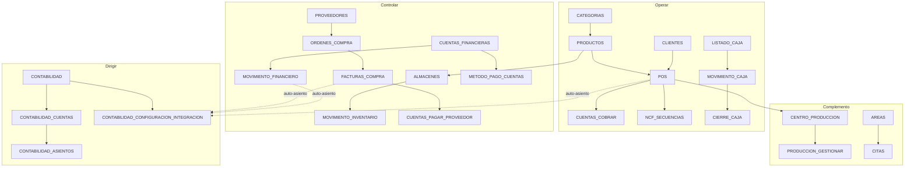

# Mapa definitivo de módulos — Alahia ERP
**MacroBits · Julio 2026 · Propuesta híbrida Operar / Controlar / Dirigir**

> Objetivo: clasificar **cada** código de módulo (BD + UI) antes de precios. Ninguno queda sin categoría.
>
> Universo: 80 módulos activos en `AlahiaPos_Dev.Modulos` + códigos de menú/rutas/aliases sin fila en BD.

---

## 1. Leyenda

| Campo | Valores |
|-------|---------|
| **Experiencia** | `Operar` · `Controlar` · `Dirigir` · `Complemento` · `Interno` · `Retirar/Fusionar` · `Alta pendiente` |
| **Tipo** | Cliente · Permiso hijo · Interno MacroBits · Alias UI · Código huérfano (ruta/menú sin BD) |
| **Madurez** | GA · Beta/WIP · Incompleto · Alias · Solo interno |
| **Dep. dura** | Fallo o sin sentido funcional si falta |
| **Dep. datos** | Usa datos del otro módulo pero puede existir sin licencia |
| **Dep. comercial** | Debe venderse junto (paquete) aunque el runtime no falle |

---

## 2. Drift catálogo (decisiones previas)

| Código | Situación | Decisión |
|--------|-----------|----------|
| `TRANSFERENCIAS_FINANCIERAS` | En menú/ruta; **no existe** en `Modulos` | **Alta pendiente** → crear en BD; experiencia **Controlar**; hoy la UI puede estar usando permiso `MOVIMIENTO_FINANCIERO` |
| `MOVIMIENTOS_FINANCIEROS` | Solo título en `MODULO_TITULOS_MENU` | **Alias** de `MOVIMIENTO_FINANCIERO` → Fusionar título; no crear módulo |
| `FE_*` (6 códigos menú) | En menú/rutas; **no existen** en `Modulos` | **Alta pendiente** como hijos de un padre `FACTURACION_ELECTRONICA` o reutilizar/ampliar `NCF_SECUENCIAS` + suite FE; experiencia **Operar** (cumplimiento) |
| `FE_REPROCESAR` | Solo ruta | **Alta pendiente** · permiso hijo FE · no cobrable |
| `CONCILIACION_BANCARIA`, `EXTRACTO_BANCARIO` | Rutas UI; **no** en menú ni BD | **Alta pendiente** · Beta · **Controlar** cuando GA; no vender ahora |
| `IT1`, `DGII_FISCAL`, `CONFIGURACION_DGII` | Títulos/aliases fiscales | **No GA** · no menú activo · **Alta pendiente** o fusionar en FE; no vender |
| `CONTABILIDAD` | BD + gatekeeper; excluido como ítem de menú | Padre **Dirigir**; licencia maestra de la suite |
| `PRODUCCION_*` (4) | BD; no ítems de menú | Permisos hijos de `CENTRO_PRODUCCION` · **Complemento** (no cobrables aparte) |
| `MACROBITS_ADMIN` | BD; excluido menú (duplica políticas) | **Interno** · Fusionar UX con `POLITICAS_VERSIONES` |
| `LISTADO_PAGOS` | Descripción BD habla de “pagos de empresas” | Auditar pantalla: si es CxC cliente → **Operar**; si es SaaS → **Interno**/mover a `PAGO_SUSCRIPCION`. **Propuesta:** clasificar como **Operar** (pagos de facturas cliente) y corregir descripción BD |

---

## 3. Inventario clasificado — módulos en BD (80/80)

### 3.1 Operar (núcleo de experiencia)

| Código | Nombre | Tipo | Madurez | Dep. dura | Dep. comercial | Notas |
|--------|--------|------|---------|-----------|----------------|-------|
| DASHBOARD | Dashboard | Cliente | GA | — | — | Panel; puede vivir solo |
| POS | Punto de Venta | Cliente | GA | PRODUCTOS, CATEGORIAS | CLIENTES, NCF_SECUENCIAS, caja | Soft: CxC si fiado |
| ORDENES | Órdenes recientes | Cliente | GA | POS | — | Vista operativa POS |
| HISTORICO_FACTURAS | Histórico facturas | Cliente | GA | POS | — | |
| LISTADO_DEVOLUCIONES | Devoluciones | Cliente | GA | POS | NOTAS_CREDITO_APLICADAS | |
| NOTAS_CREDITO_APLICADAS | NC aplicadas | Cliente | GA | POS | LISTADO_DEVOLUCIONES | |
| DESCUENTOS | Descuentos | Cliente | GA | POS, PRODUCTOS | — | Precio catálogo >0 histórico |
| CLIENTES | Clientes | Cliente | GA | — | — | |
| CUENTAS_COBRAR | CxC | Cliente | GA | CLIENTES, POS | — | Soft-gate en POS |
| CATEGORIAS | Categorías | Cliente | GA | — | PRODUCTOS | |
| PRODUCTOS | Productos | Cliente | GA | CATEGORIAS | — | |
| LISTADO_CAJA | Listado caja | Cliente | GA | — | MOVIMIENTO_CAJA, CIERRE_CAJA | Paquete caja |
| MOVIMIENTO_CAJA | Movimiento caja | Cliente | GA | LISTADO_CAJA | CIERRE_CAJA | |
| CIERRE_CAJA | Cierre caja | Cliente | GA | LISTADO_CAJA | MOVIMIENTO_CAJA | |
| GASTOS | Gastos | Cliente | GA | — | CUENTAS_FINANCIERAS (recom.) | Operable sin bancos |
| INGRESOS | Ingresos | Cliente | GA | — | CUENTAS_FINANCIERAS (recom.) | |
| LISTADO_PAGOS | Listado pagos | Cliente | GA* | CLIENTES/CUENTAS_COBRAR | — | *Validar UI; ver §2 |
| NCF_SECUENCIAS | Comprobantes fiscales | Cliente | GA | EMPRESA | POS | Base fiscal; puente a FE |
| REPORTE_VENTA | Reporte venta | Cliente | GA | POS | — | **Nunca cobrar aparte** |
| REPORTE_607 | Reporte 607 | Cliente | GA | POS | NCF/FE | Cumplimiento básico |
| REPORTE_CLIENTES | Reporte clientes | Cliente | GA | CLIENTES | — | |
| REPORTE_PRODUCTOS | Reporte productos | Cliente | GA | PRODUCTOS | — | |
| EMPRESA | Empresa | Cliente | GA | — | — | |
| PARAMETROS | Parámetros | Cliente | GA | EMPRESA | — | |
| EMPLEADOS | Empleados | Cliente | GA | — | USUARIOS | |
| USUARIOS | Usuarios | Cliente | GA | EMPLEADOS, PERFILES | — | |
| PERFILES | Perfiles | Cliente | GA | — | USUARIOS | |
| TICKETS | Tickets soporte | Cliente | GA | — | — | Soporte incluido |
| PAGO_SUSCRIPCION | Pago suscripción | Cliente | GA | — | — | Self-service cobro SaaS del cliente |

**Conteo Operar (BD): 29**

---

### 3.2 Controlar (suma a Operar)

| Código | Nombre | Tipo | Madurez | Dep. dura | Dep. comercial | Notas |
|--------|--------|------|---------|-----------|----------------|-------|
| ALMACENES | Almacenes | Cliente | GA | PRODUCTOS | MOVIMIENTO_INVENTARIO | Multi-bodega |
| MOVIMIENTO_INVENTARIO | Mov. inventario | Cliente | GA | ALMACENES, PRODUCTOS | — | Incluye transferencias |
| CONDUCES | Conduces | Cliente | GA | PRODUCTOS, CLIENTES | POS (recom.) | Entrega vs factura |
| REPORTE_PERDIDAS | Pérdidas inv. | Cliente | GA | MOVIMIENTO_INVENTARIO | ALMACENES | |
| PROVEEDORES | Proveedores | Cliente | GA | — | — | |
| ORDENES_COMPRA | Órdenes compra | Cliente | GA | PROVEEDORES, PRODUCTOS | ALMACENES | |
| FACTURAS_COMPRA | Facturas compra | Cliente | GA | PROVEEDORES | ORDENES_COMPRA, CUENTAS_PAGAR_PROVEEDOR | |
| CUENTAS_PAGAR_PROVEEDOR | CxP | Cliente | GA | PROVEEDORES, FACTURAS_COMPRA | — | |
| ANALISIS_COMPRAS_PRODUCTO | Análisis producto-proveedor | Cliente | GA | FACTURAS_COMPRA | PRODUCTOS | |
| REPORTE_606 | Formato 606 | Cliente | GA | FACTURAS_COMPRA | — | Fiscal compras |
| REPORTE_PROVEEDORES | Reporte proveedores | Cliente | GA | PROVEEDORES | — | |
| CUENTAS_FINANCIERAS | Cuentas financieras | Cliente | GA | — | METODO_PAGO_CUENTAS | Bancos/cajas contables |
| MOVIMIENTO_FINANCIERO | Mov. financieros | Cliente | GA | CUENTAS_FINANCIERAS | — | Libro; título confuso vs transferencias |
| METODO_PAGO_CUENTAS | Métodos pago→cuenta | Cliente | GA | CUENTAS_FINANCIERAS | POS | Mapeo cobros |
| ANTIGUEDAD_CXC | Antigüedad CxC | Cliente | GA | CUENTAS_COBRAR | — | |
| ANTIGUEDAD_CXP | Antigüedad CxP | Cliente | GA | CUENTAS_PAGAR_PROVEEDOR | — | |

**Conteo Controlar (BD): 16**

*(Transferencias, extracto, conciliación: ver §4 altas pendientes → Controlar cuando existan en BD y GA.)*

---

### 3.3 Dirigir (suma a Controlar)

| Código | Nombre | Tipo | Madurez | Dep. dura | Dep. comercial | Notas |
|--------|--------|------|---------|-----------|----------------|-------|
| CONTABILIDAD | Contabilidad (padre) | Cliente | GA | CONTABILIDAD_CUENTAS | CONTABILIDAD_CONFIGURACION_INTEGRACION | Gatekeeper licencia |
| CONTABILIDAD_CUENTAS | Catálogo cuentas | Permiso/hijo | GA | CONTABILIDAD | — | Incluido en Dirigir |
| CONTABILIDAD_ASIENTOS | Asientos | Permiso/hijo | GA | CONTABILIDAD, CONTABILIDAD_CUENTAS | — | |
| CONTABILIDAD_LIBRO_DIARIO | Libro diario | Permiso/hijo | GA | CONTABILIDAD | — | |
| CONTABILIDAD_MAYOR_GENERAL | Mayor | Permiso/hijo | GA | CONTABILIDAD | — | |
| CONTABILIDAD_BALANCE_COMPROBACION | Balance comprobación | Permiso/hijo | GA | CONTABILIDAD | — | |
| CONTABILIDAD_ESTADO_RESULTADOS | Estado resultados | Permiso/hijo | GA | CONTABILIDAD | — | |
| CONTABILIDAD_BALANCE_GENERAL | Balance general | Permiso/hijo | GA | CONTABILIDAD | — | |
| CONTABILIDAD_CONSULTA_ASIENTOS | Consulta asientos | Permiso/hijo | GA | CONTABILIDAD | — | |
| CONTABILIDAD_CIERRE | Cierre | Permiso/hijo | GA | CONTABILIDAD | — | |
| CONTABILIDAD_CONFIGURACION_INTEGRACION | Config integración | Permiso/hijo | GA | CONTABILIDAD, CONTABILIDAD_CUENTAS | — | Auto-asientos |
| ACTIVOS_FIJOS | Activos fijos | Cliente | **Incompleto** | EMPRESA | CONTABILIDAD (recom.) | CRUD/listado; **sin depreciación** → no oversell |
| REPORTE_EMPLEADOS | Reporte empleados | Cliente | GA | EMPLEADOS | — | Gerencial ligero |
| REPORTE_COMISIONES | Reporte comisiones | Cliente | GA | EMPLEADOS_COMISION o ventas | — | Mejor con vertical comisiones |
| REPORTE_SERVICIOS | Reporte servicios | Cliente | GA | PRODUCTOS/servicios | HISTORIAL_SERVICIOS (opcional) | |

**Conteo Dirigir (BD): 15**

**Regla comercial crítica:** Contabilidad **no** exige Compras ni Bancos de forma dura.  
- Auto-asiento de venta → necesita POS + mapeo.  
- Auto-asiento de compra → necesita compras si se usan.  
- Auto-asiento de banco → necesita cuentas financieras si se usan.  
**Propuesta:** Dirigir incluye suite contable + config; recomienda Controlar, pero un cliente de servicios puede Dirigir con Operar + Contabilidad si no maneja inventario (excepción comercial documentada: “Dirigir Lite” solo si se valida contabilidad sin inventario). **Default del recomendador:** Dirigir ⊃ Controlar ⊃ Operar.

---

### 3.4 Complementos (verticales / add-ons)

| Código | Nombre | Tipo | Madurez | Dep. dura | Dep. comercial | Notas |
|--------|--------|------|---------|-----------|----------------|-------|
| CENTRO_PRODUCCION | Centro producción | Cliente | GA* | POS/ORDENES, PRODUCTOS | PRODUCCION_* | *Tablero/KDS, **no MRP/BOM** |
| PRODUCCION_GESTIONAR | Prod. gestionar | Permiso hijo | GA | CENTRO_PRODUCCION | — | No cobrable aparte |
| PRODUCCION_CANCELAR | Prod. cancelar | Permiso hijo | GA | CENTRO_PRODUCCION | — | |
| PRODUCCION_PRIORIDAD | Prod. prioridad | Permiso hijo | GA | CENTRO_PRODUCCION | — | |
| PRODUCCION_CONFIG | Prod. config | Permiso hijo | GA | CENTRO_PRODUCCION | — | |
| AREAS | Áreas | Cliente | GA | — | CITAS | Vertical salón |
| CITAS | Citas | Cliente | GA | AREAS, CLIENTES, EMPLEADOS | — | |
| HORARIO_ESTILISTA | Horario estilista | Cliente | GA | EMPLEADOS, AREAS | CITAS | |
| EMPLEADOS_COMISION | Comisiones empleado | Cliente | GA | EMPLEADOS | AREAS/servicios | Precio catálogo >0 |
| DOCUMENTOS_CLINICOS | Docs clínicos | Cliente | GA | CLIENTES | — | Vertical dental |
| HISTORIAL_SERVICIOS | Historial servicios | Cliente | GA | CLIENTES, PRODUCTOS | DOCUMENTOS_CLINICOS | |
| CONSUMO_LAVADORES | Consumo lavadores | Cliente | GA | CLIENTES/PRODUCTOS | — | Vertical lavado |
| BIZCOCHO_ENCARGO | Bizcocho encargo | Cliente | GA | CLIENTES, PRODUCTOS | — | Nicho bakery |
| CUMPLEANEROS | Cumpleañeros | Cliente | GA | CLIENTES | — | Ligero; puede vivir en Operar como feature, pero hoy es módulo → **Complemento marketing** o mover a Operar |
| ALAHIA_AI | Alahia AI | Cliente | GA* | DASHBOARD (UX) | — | *Depende de API keys; no núcleo |

**Conteo Complemento (BD): 15**

**Ajuste propuesto:** `CUMPLEANEROS` → mover a **Operar** (feature CRM ligera) o dejar complemento; recomendación: **Operar** porque no es vertical y el precio histórico $10 confunde. Justificación: evita upsell por “ver cumpleaños”.

---

### 3.5 Interno MacroBits (no vender al cliente final)

| Código | Nombre | Tipo | Madurez | Dep. | Notas |
|--------|--------|------|---------|------|-------|
| MACROBITS_ADMIN | Admin MacroBits | Interno | GA | POLITICAS_VERSIONES | Duplica ruta políticas |
| POLITICAS_VERSIONES | Políticas servicio | Interno | GA | — | Publicación políticas plataforma |
| POLITICAS_ACEPTACIONES | Aceptaciones | Interno | GA | POLITICAS_VERSIONES | Panel MacroBits |
| SUSCRIPCIONES_COBROS | Cobros admin | Interno | GA | — | Inbox cobros SaaS |
| TICKETS_ADMIN | Tickets admin | Interno | GA | TICKETS | Inbox soporte MacroBits |

**Conteo Interno (BD): 5**

---

### 3.6 Verificación cobertura BD

| Bucket | Cantidad |
|--------|----------|
| Operar | 29 |
| Controlar | 16 |
| Dirigir | 15 |
| Complemento | 15 |
| Interno | 5 |
| **Total BD** | **80** |

Si se acepta mover `CUMPLEANEROS` a Operar: Operar 30 / Complemento 14 (sigue 80).

---

## 4. Códigos UI / huérfanos (fuera de BD) — todos clasificados

| Código | Tipo | Experiencia | Madurez | Acción |
|--------|------|-------------|---------|--------|
| TRANSFERENCIAS_FINANCIERAS | Huérfano menú | Controlar | GA UI / sin licencia | Crear módulo BD o mapear a `MOVIMIENTO_FINANCIERO` |
| FE_CONFIGURACION | Huérfano menú | Operar (suite FE) | GA UI | Crear suite FE en BD |
| FE_SECUENCIAS | Huérfano menú | Operar | GA UI | Hijo FE; puede solapar NCF_SECUENCIAS |
| FE_CERTIFICADO | Huérfano menú | Operar | GA UI | Hijo FE |
| FE_ESTADO_DGII | Huérfano menú | Operar | GA UI | Hijo FE |
| FE_HISTORIAL | Huérfano menú | Operar | GA UI | Hijo FE |
| FE_MONITOREO | Huérfano menú | Operar | GA UI | Hijo FE |
| FE_REPROCESAR | Huérfano ruta | Operar | GA UI | Permiso hijo FE |
| CONCILIACION_BANCARIA | Huérfano ruta | Controlar | **Beta** | Alta BD + menú solo cuando GA |
| EXTRACTO_BANCARIO | Huérfano ruta | Controlar | **Beta** | Idem |
| IT1 | Alias/título | Dirigir/Fiscal | No GA | No vender; backlog fiscal |
| DGII_FISCAL | Alias | Operar/Fiscal | No GA | Fusionar en FE |
| CONFIGURACION_DGII | Alias | Operar/Fiscal | No GA | Fusionar en FE |
| MOVIMIENTOS_FINANCIEROS | Alias título | Controlar | Alias | Usar `MOVIMIENTO_FINANCIERO` |

**Ningún código UI queda sin estado.**

---

## 5. Matriz de dependencias (resumen)



### Dependencias duras (runtime / negocio)

| Origen | Requiere | Tipo |
|--------|----------|------|
| POS | PRODUCTOS, CATEGORIAS | Dura |
| CUENTAS_COBRAR | CLIENTES | Dura |
| ORDENES_COMPRA / FACTURAS_COMPRA | PROVEEDORES, PRODUCTOS | Dura |
| CUENTAS_PAGAR_PROVEEDOR | FACTURAS_COMPRA | Dura |
| MOVIMIENTO_INVENTARIO | ALMACENES, PRODUCTOS | Dura |
| MOVIMIENTO_FINANCIERO / METODO_PAGO_CUENTAS | CUENTAS_FINANCIERAS | Dura |
| CONTABILIDAD_* hijos | CONTABILIDAD (+ CUENTAS para asientos) | Dura |
| ContabilidadGatekeeper | Empresa_Modulos CONTABILIDAD | Dura licencia |
| CENTRO_PRODUCCION + hijos | Licencia CENTRO_PRODUCCION; datos POS/PRODUCTOS | Dura licencia / datos |
| CITAS | AREAS, CLIENTES | Dura |
| DOCUMENTOS_CLINICOS | CLIENTES | Dura |
| REPORTE_606 | FACTURAS_COMPRA | Dura datos |
| REPORTE_607 | Ventas/POS | Dura datos |
| ANTIGUEDAD_CXC / CXP | CUENTAS_COBRAR / CUENTAS_PAGAR_PROVEEDOR | Dura |

### Dependencias comerciales recomendadas (empaquetado)

| Paquete | Incluir juntos |
|---------|----------------|
| Caja | LISTADO_CAJA + MOVIMIENTO_CAJA + CIERRE_CAJA |
| Ventas núcleo | POS + ORDENES + HISTORICO + devoluciones/NC + DESCUENTOS |
| Fiscal Operar | NCF_SECUENCIAS + (futura suite FE_*) + REPORTE_607 |
| Inventario | ALMACENES + MOVIMIENTO_INVENTARIO + REPORTE_PERDIDAS |
| Compras | PROVEEDORES + OC + FACTURAS + CxP + 606 |
| Tesorería | CUENTAS_FINANCIERAS + MOVIMIENTO_FINANCIERO + METODO_PAGO_CUENTAS + TRANSFERENCIAS (alta) |
| Contabilidad | CONTABILIDAD + todos CONTABILIDAD_* |
| Producción | CENTRO_PRODUCCION + PRODUCCION_* (permisos, $0 aparte) |
| Salón | AREAS + CITAS + HORARIO_ESTILISTA (+ EMPLEADOS_COMISION opcional) |
| Dental | DOCUMENTOS_CLINICOS + HISTORIAL_SERVICIOS |

### Lo que NO es dependencia dura (evitar overpack)

| Afirmación incorrecta | Realidad |
|----------------------|----------|
| Contabilidad exige Compras | Falso; solo si hay eventos de compra |
| Contabilidad exige Bancos | Falso; solo para asientos de tesorería |
| Producción exige Inventario | Falso hoy (tablero de órdenes); sí si se consume stock en futuro |
| AI exige Contabilidad | Falso |
| e-CF exige Contabilidad | Falso; exige ventas + certificado/secuencias |

---

## 6. Presets híbridos (módulos por experiencia)

### Operar — preset default
Todos los de §3.1 **+** (cuando existan en BD) FE_* suite.  
**Excluye:** inventario avanzado, compras, bancos (salvo que GASTOS/INGRESOS usen efectivo caja), contabilidad, verticales, AI, internos.

### Controlar — preset
Operar + §3.2 + TRANSFERENCIAS_FINANCIERAS (tras alta).  
**No incluye** por defecto: Contabilidad, verticales, AI.  
**Opcional futuro GA:** EXTRACTO + CONCILIACION.

### Dirigir — preset
Controlar + §3.3 (suite CONTABILIDAD completa).  
ACTIVOS_FIJOS: incluir con disclaimer de madurez o mover a “próximamente” hasta depreciación.

### Complementos (cualquier experiencia)
Lista §3.4; producción y verticales nunca mezclados en el precio base de Operar/Controlar/Dirigir.

### Interno
Solo perfiles MacroBits / empresa sistema.

---

## 7. Correcciones de ubicación y packaging

| # | Problema | Solución propuesta | Justificación |
|---|----------|--------------------|---------------|
| 1 | FE en menú sin BD | Crear `FACTURACION_ELECTRONICA` padre + hijos FE_* o ampliar NCF | Sin licencia no se puede empaquetar e-CF en Operar de forma limpia |
| 2 | TRANSFERENCIAS sin BD | Alta `TRANSFERENCIAS_FINANCIERAS` en Modulos | Hoy el menú miente al RBAC |
| 3 | MOVIMIENTO_FINANCIERO nombre/typo | Renombrar UI a “Movimientos / libro”; transferencias módulo aparte | Reduce confusión comercial |
| 4 | CONTABILIDAD_* como “módulos cobrables” | Vender **un** add-on/experiencia Dirigir; hijos = permisos | Evita Sicflex-style nickel-and-dime |
| 5 | PRODUCCION_* cobrables | Incluidos en CENTRO_PRODUCCION | Son RBAC, no valor aparte |
| 6 | CUMPLEANEROS como premium | Mover a Operar | No es vertical; castiga CRM básico |
| 7 | Conciliación/extracto | Beta explícita; no en Controlar GA | Evita overpromise |
| 8 | IT1 / DGII aliases | Fuera de catálogo vendible | No hay menú GA |
| 9 | ACTIVOS_FIJOS en Dirigir | Incluir como “registro” o beta hasta depreciación | Honestidad de producto |
| 10 | MACROBITS_ADMIN vs POLITICAS | Un solo módulo interno visible | Menú ya excluye uno |
| 11 | PerfilRoles vs Empresa_Modulos | Manifiesto: al activar experiencia, sync ambos | Evita menú sin licencia y viceversa |
| 12 | LISTADO_PAGOS descripción | Corregir copy BD si es pagos cliente | Claridad de mapa |

---

## 8. Manifiesto canónico (estructura recomendada)

No implementa código aún; define el contrato futuro:

```text
Experiencia {
  codigo: Operar | Controlar | Dirigir
  modulosLicencia: string[]      // Empresa_Modulos
  modulosPerfilAdmin: string[]   // PerfilRoles admin default
  permisosHijosIncluidos: string[]
}

Complemento {
  codigo: string
  requiereExperienciaMinima?: Operar | Controlar | Dirigir
  modulos: string[]
  permisosHijos: string[]
}
```

Reglas:
1. Activar experiencia = upsert licencia + perfil.
2. Activar complemento = valida `requiereExperienciaMinima` + upsert.
3. Hijos contables/producción nunca aparecen como línea de cobro.
4. Internos nunca en manifiestos cliente.

---

## 9. Anexo de cobertura

Verificado contra `AlahiaPos_Dev.Modulos` (Activo=1) el 2026-07-21: **COUNT = 80**.

### BD `Modulos` activos: 80 → clasificados 80
Ver §3.1–§3.5. Desglose: Operar 29 + Controlar 16 + Dirigir 15 + Complemento 15 + Interno 5 = **80**.

### Códigos UI sin fila en BD (14) — todos en §4
Consulta Diff (menú ∪ rutas ∪ títulos) − Modulos:
`TRANSFERENCIAS_FINANCIERAS`, `FE_CONFIGURACION`, `FE_SECUENCIAS`, `FE_CERTIFICADO`, `FE_ESTADO_DGII`, `FE_HISTORIAL`, `FE_MONITOREO`, `CONCILIACION_BANCARIA`, `EXTRACTO_BANCARIO`, `FE_REPROCESAR`, `IT1`, `DGII_FISCAL`, `CONFIGURACION_DGII`, `MOVIMIENTOS_FINANCIEROS`.

### Menú `MENU_GRUPOS`
- Presentes en BD o listados arriba.
- `CONTABILIDAD` excluido de ítem pero clasificado Dirigir.
- `MACROBITS_ADMIN` excluido de ítem pero clasificado Interno.

### Universo total clasificado
**80 (BD) + 14 (UI) = 94 códigos · faltantes: 0.**

Canvas ejecutivo con filtros: `canvases/Mapa-Definitivo-Modulos-Alahia-ERP.canvas.tsx`.

---

## 10. Lectura para precios (siguiente fase)

Variables justas de empaquetado:
- Experiencia (Operar / Controlar / Dirigir)
- Usuarios
- Complementos verticales / Producción / AI
- Servicio e-CF Premium (humano), no FE_* como microcargos

No usar: cantidad de facturas, ingresos, ni venta separada de reportes 606/607/venta.

---

*Mapa vivo · Actualizar cuando se inserten FE_*, TRANSFERENCIAS, conciliación en Modulos.*
